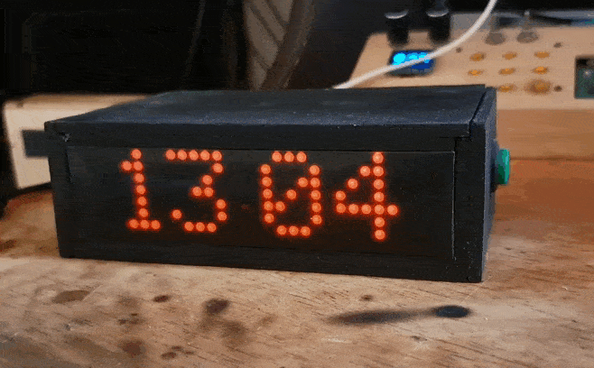
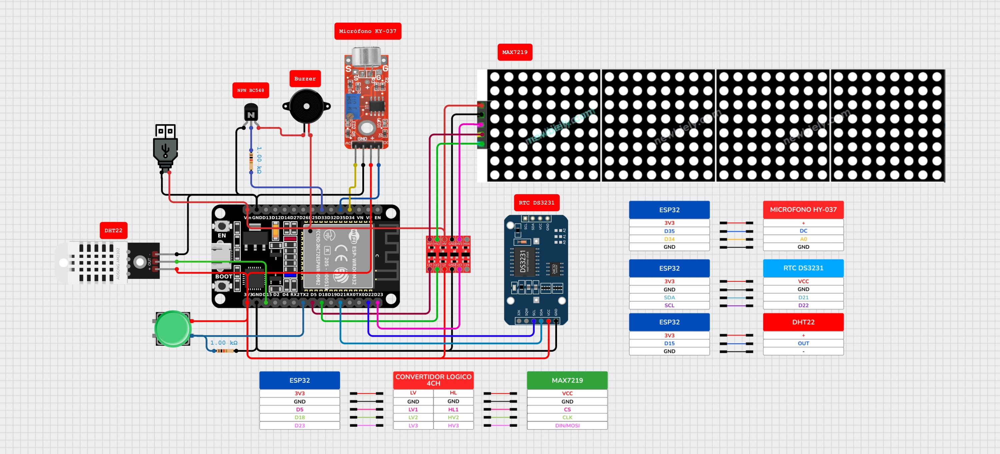

# Reloj y Temperatura con MAX7219 ESPUI - ESP32

Este proyecto consiste en un reloj digital desarrollado con un **ESP32**, que utiliza una pantalla **MAX7219** y una interfaz web interactiva con **ESPUI**. Incluye diversas funciones para mostrar la hora, temperatura, humedad, mensajes personalizados, y controlar configuraciones avanzadas como alarmas y animaciones.

  
  

  

## 🗂️ Características

- **Visualización en pantalla:**
  - Hora actual sincronizada por NTP o RTC.
  - Temperatura y humedad en tiempo real.
- **Alarma:** Configurable desde la interfaz web.
- **Cambio de vistas con aplausos:** Detecta sonidos mediante un micrófono.
- **Conexión WiFi:** Funciona en los modos:
  - **Station (STA):** Se conecta a una red WiFi existente para sincronización NTP y acceso a la interfaz web.
  - **Access Point (AP):** Crea un punto de acceso para ingresar a la interfaz web.
- **Interfaz web (ESPUI):**
  - Configuración de hora.
  - Selección de modos de animación.
  - Programación de alarmas.
  - Mostrar mensajes personalizados.
  - Configuración de credenciales WiFi.
- **Temporizador:**
  - Temporizador desde el encoder mediante una pulsación larga.

> Para acceder al portal web: ` http://espui.local`

## 🗺️ Diagrama

  

## 🛠️ Configuración del Entorno

- **IDE:** Arduino `v2.3.x`
- **Framework:** Arduino ESP32 `v2.0.17`
- **Board:** ESP32 Dev Module
- **Partition:** Default 4MB with spiffs(1.2MB APP/1.5MB SPIFFS)

### Librerías

- **ESPUI:** `v2.2.4`
- **MD_Parola:** `v3.7.3`
  - **MD_MAX72XX:** `v3.5.1`
- **RTClib:** `v2.1.4`
- **DHT sensor library:** `v1.4.6`
- **ESPAsyncWebServer** `v3.1.0`
  - **AsyncTCP:** `v1.1.4`
  - **ESPAsyncTCP:** `v1.2.4`
- **ArduinoJson** `v6.21.5`

## 🔌 Hardware

- x1 **ESP32 Dev Module**
- x1 Pantalla matriz 8x32 **MAX7219**
- x1 Modulo sensor **DHT22**
- x1 Módulo RTC **DS3231** (opcional)
- x1 Encoder rotatorio
- x1 Módulo conversor lógico **4CH**
- x1 Zumbador piezoeléctrico
- x1 Transistor NPN **BC548**
- x1 Pulsador momentáneo
- x2 Resistencia de 1 kΩ
- 1x Conector JAC hembra

## 🌐 Interfaz ESPUI

  
  

  
  

  
  

### Configuración tras cargar el código
1. **Conéctate a la red WiFi**  
   - Por defecto, el ESP32 intentará conectarse a la última red WiFi configurada.
   - Si no encuentra la red, creará un punto de acceso WiFi llamado `ESPUI-MAX`.
   - Busca la red WiFi desde tu PC o móvil y conéctate a ella.

2. **Accede a la interfaz web**  
   - Si el ESP32 está en modo Access Point, abre tu navegador y entra a la dirección:  
     `http://192.168.6.1`
   - Si está conectado a tu red WiFi, puedes acceder desde:  
     `http://espui.local`  
     o usando la IP que muestra el monitor serie.

3. **Configura la red WiFi (opcional)**  
   - Desde la pestaña **Wifi** en la interfaz web, introduce el SSID y la CONTRASEÑA de tu red WiFi.