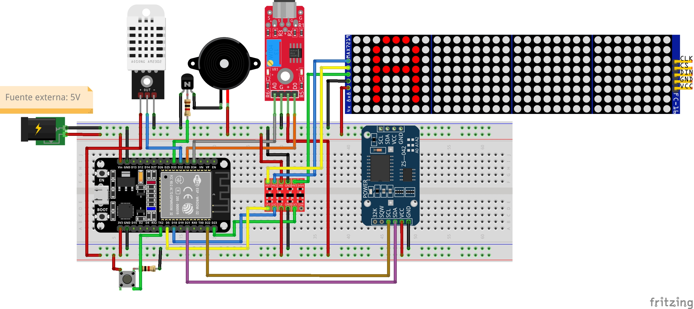

# Reloj y Temperatura con MAX7219 ESPUI - ESP32

Este proyecto consiste en un reloj digital desarrollado con un **ESP32**, que utiliza una pantalla **MAX7219** y una interfaz web interactiva con **ESPUI**. Incluye diversas funciones para mostrar la hora, temperatura, humedad, mensajes personalizados, y controlar configuraciones avanzadas como alarmas y animaciones.

---

  
  

  

---

## Caracteristicas

- **Visualización en pantalla:**
  - Hora actual sincronizada por NTP o RTC.
  - Temperatura y humedad en tiempo real.
- **Alarma:** Configurable desde la interfaz web.
- **Cambio de vistas con aplausos:** Detecta sonidos mediante un micrófono.
- **Conexión WiFi:** Funciona en los modos:
  - **Station (STA):** Se conecta a una red WiFi existente para sincronización NTP y acceso a la interfaz web.
  - **Access Point (AP):** Crea un punto de acceso para ingresar a la interfaz web.
- **Interfaz web (ESPUI):**
  - Configuración de hora.
  - Selección de modos de animación.
  - Programación de alarmas.
  - Mostrar mensajes personalizados.
  - Configuración de credenciales WiFi.

> Para acceder al portal web: ` http://espui.local`

---

## Diagrama

  

---

## Configuración del Entorno

- **IDE:** Arduino `v2.3.x`
- **Framework:** Arduino ESP32 `v2.0.17`
- **Board:** ESP32 Dev Module
- **Partition:** Default 4MB with spiffs(1.2MB APP/1.5MB SPIFFS)

### Librerías

- **ESPUI:** `v2.2.4`
- **MD_Parola:** `v3.7.3`
- **RTClib:** `v2.1.4`
- **DHT sensor library:** `v1.4.6`
- **ESPAsyncWebServer** `v3.1.0`
- **ArduinoJson** `v6.21.5`

---

## Componentes del Hardware

- 1x **ESP32 Dev Module**
- 1x Pantalla matriz 8x32 **MAX7219**
- 1x Modulo sensor **DHT22**
- 1x Módulo RTC **DS3231** (opcional)
- 1x Módulo micrófono **KY-037**
- 1x Módulo convertidor lógico **4CH**
- 1x Zumbador piezoeléctrico
- 1x Transistor NPN **BC548**
- 1x Pulsador momentáneo
- 1x Resistencia de 10 kΩ
- 1x Resistencia de 1 kΩ
- 1x Conector JAC hembra

## Interfaz ESPUI

  
  

  
  

  
  

