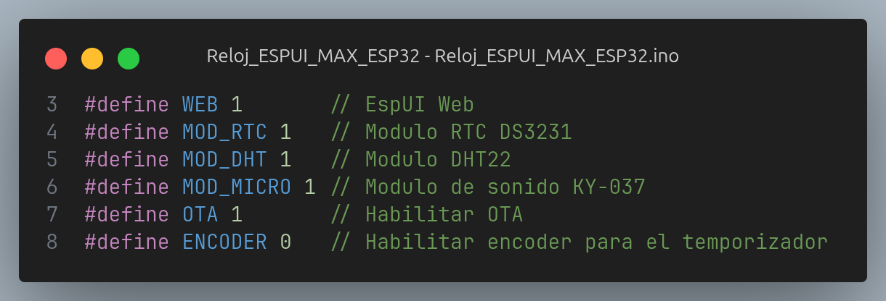
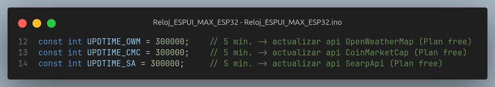
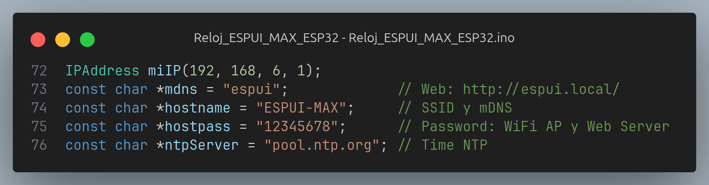

# Reloj y Temperatura con MAX7219 ESPUI - ESP32

Este proyecto consiste en un reloj digital desarrollado con un **ESP32**, que utiliza una pantalla **MAX7219** y una interfaz web interactiva con **ESPUI**. Incluye diversas funciones para mostrar la **hora**, **temperatura**, **humedad**, **criptomonedas**, **resultado de futbol**, **mensajes personalizados** y **alarma** y configuracion de las animaciones.

<p align="center">
  
  
</p>

<p align="center">
  
</p>

## 🗂️ Características
- **Visualización en pantalla:**
  - Hora actual sincronizada por NTP o RTC.
  - Temperatura y humedad en tiempo real.
- **Alarma:** Configurable desde la interfaz web.
- **Cambio de vistas con aplausos:** Detecta sonidos mediante un micrófono.
- **Conexión WiFi:** Funciona en los modos:
  - **Station (STA):** Se conecta a una red WiFi existente para sincronización NTP y acceso a la interfaz web.
  - **Access Point (AP):** Crea un punto de acceso para ingresar a la interfaz web.
- **Interfaz web (ESPUI):**
  - Configuración de hora.
  - Selección de modos de efectos.
  - Programación de alarmas.
  - Mostrar mensajes personalizados.
  - Configuracion de APIs.
    - Configuracion de la api de [openWeatherMap](https://home.openweathermap.org/api_keys)
    - Configuracion de la api de [coinMarketCap](https://pro.coinmarketcap.com/account)
    - Configuracion de la api de [serpApi](https://serpapi.com/dashboard)
  - Configuración de credenciales WiFi.
- **Temporizador:**
  - Temporizador desde el encoder mediante una pulsación larga.

> Para acceder al portal web: ` http://espui.local`

## 🗺️ Diagrama

<p align="center">
  
</p>

## 🔌 Hardware

- x1 **ESP32 Dev Module**
- x1 Pantalla matriz 8x32 **MAX7219**
- x1 Modulo sensor **DHT22***(opcional)*
- x1 Módulo RTC **DS3231** *(opcional)*
- x1 Modulo de sonido **KY-038** *(opcional)*
- x1 Modulo Encoder rotatorio *(funcion temporizador)*
- x1 Módulo conversor lógico **4CH**
- x1 Zumbador piezoeléctrico
- x1 Transistor **NPN BC548**
- x1 Pulsador momentáneo
- x2 Resistencia de 1 kΩ
- 1x Conector JAC hembra

## 🛠️ Configuración del Entorno

- **IDE:** Arduino `v2.3.x`
- **Framework:** Arduino ESP32 `v2.0.17`
- **Board:** `ESP32 Dev Module`
- **Partition:** `Minimal SPIFFS(1.9MB APP with OTA/190KB SPIFFS)` o `Default 4MB with spiffs (1.2MB APP/1.5MB SPIFFS)` (sin funcion OTA)

### Librerías

- **ESPUI:** `v2.2.4`
- **MD_Parola:** `v3.7.3`
  - **MD_MAX72XX:** `v3.5.1`
- **RTClib:** `v2.1.4`
- **DHT sensor library:** `v1.4.6`
- **ESPAsyncWebServer** `v3.10.0 by ESP32Async`
  - **AsyncTCP:** `v3.4.10 by ESP32Async`
- **ArduinoJson** `v7.0.4`

## ⚙️ Configuracion de inicio
Antes de compilar y cargar el firmware en la placa, es posible configurar distintos parametros.

### Habilitación de módulos
Por defecto todos están habilitados, pero pueden desactivarse si no se dispone del hardware correspondiente o no se desea utilizar esa funcionalidad.

- **WEB** → Habilita la interfaz web basada en **ESPUI** para configuración desde el navegador.
- **MOD_RTC** → Activa el uso del módulo **RTC DS3231** para mantener la hora en tiempo real. Se utiliza principalmente cuando no hay conexión a internet, ya que con conexión se puede obtener la hora mediante **NTP/UDP**.
- **MOD_DHT** → Habilita la lectura del sensor de temperatura y humedad **DHT22**. Es útil si no se dispone de conexión a internet, ya que con internet estos datos pueden obtenerse desde la API de OpenWeatherMap pero menos precisos.
- **MOD_MICRO** → Activa el módulo de sonido **KY-037** para detección de ruido que se usa para cambiar de vista mediante el ruido (aplausos).
- **OTA** → Habilita actualizaciones del firmware **OTA (Over-The-Air)** a través de la red.
- **ENCODER** → Activa el soporte para un **encoder rotatorio** utilizado para controlar el temporizador.

<p align="center">
  
</p>

### Intervalos de actualización de APIs
Antes de cargar el firmware en la placa, se pueden ajustar los intervalos de consulta a las APIs externas.  
Los valores están definidos en milisegundos y determinan cada cuánto tiempo el dispositivo solicita nuevos datos.
Por defecto están configurados en **5 minutos (300000 ms)** para respetar los límites de los planes gratuitos de las APIs utilizadas.

- **UPDTIME_OWM** → Intervalo de actualización para la API de [OpenWeatherMap](https://home.openweathermap.org/api_keys) (datos meteorológicos).
- **UPDTIME_CMC** → Intervalo de actualización para la API de [CoinMarketCap](https://pro.coinmarketcap.com/account) (datos de criptomonedas).
- **UPDTIME_SA** → Intervalo de actualización para la API de [SerpApi](https://serpapi.com/dashboard) (resultados de búsqueda). 

<p align="center">
  
</p>

### Configuración de red y servicios
Parámetros que definen la configuración básica de red del dispositivo, el acceso al servidor web y la sincronización automática de la hora mediante NTP.

* **miIP** → Dirección IP local del dispositivo en modo Access Point.
* **mdns** → Nombre mDNS para acceder al dispositivo desde la red local usando `http://nombre.local`.
* **hostname** → Nombre del dispositivo y SSID cuando crea su red WiFi.
* **hostpass** → Contraseña para la red WiFi del dispositivo y el acceso al servidor web.
* **ntpServer** → Servidor NTP utilizado para sincronizar la hora desde internet.

<p align="center">
  
</p>

### Configuración tras cargar el código
1. **Conéctate a la red WiFi**  
   - Por defecto, el ESP32 intentará conectarse a la última red WiFi configurada.
   - Si no encuentra la red, creará un punto de acceso WiFi llamado `ESPUI-MAX`.
   - Busca la red WiFi desde tu PC o móvil y conéctate a ella.

2. **Accede a la interfaz web**  
   - Si el ESP32 está en modo Access Point, abre tu navegador y entra a la dirección:  
     `http://192.168.6.1` o `http://espui.local`  
   - Si está conectado a tu red WiFi, puedes acceder desde:  
     `http://espui.local`  
     o usando la IP que muestra el monitor serie.

3. **Configura la red WiFi **  
   - Desde la pestaña **WiFi** en la interfaz web, introduce el `SSID` y la `CONTRASEÑA` de su red WiFi.

## 🌐 Interfaz ESPUI

### Vista
<p align="center">
  
</p>

### Pantalla
<p align="center">
  
</p>

### Efectos
<p align="center">
  
</p>

### Alarma
<p align="center">
  
</p>

### Texto
<p align="center">
  
</p>

### APIs
**OpenWeatherMap**
* **Ciudad** → Ciudad utilizada para obtener datos meteorológicos desde OpenWeatherMap.
  Formato: `Ciudad,CódigoPaís` (ej.: `Madrid,ES`, `New York,US` o `London,GB`).
  Las ubicaciones soportadas pueden consultarse en: https://openweathermap.org/

**SerpApi**
* **API Key #1 y API Key #2** → Se pueden configurar dos claves de SerpApi para distribuir las consultas entre ambas, ya que el plan gratuito tiene un límite de solicitudes bastante reducido.
* **Team** → Nombre del equipo deportivo que se utilizará para consultar resultados mediante SerpApi.
  Debe ingresarse el **nombre completo del equipo**, tal como aparece en los resultados de Google (ej.: `Real Madrid Club de Fútbol`, `FC Barcelona`) evitar usar caracteres especiales.
* **Location** → Ubicación utilizada por **SerpApi** para realizar la búsqueda deportiva.
  Formato: `Ciudad,Estado,Provincia,País` (ej.: `New York,New York,United States`, `Mexico City,Mexico`).
  Las ubicaciones disponibles pueden consultarse en el json de: https://serpapi.com/locations-api o usando: 
  
  ```bash
  https://serpapi.com/locations.json?q=Austin&limit=10
  ```

<p align="center">
  
</p>

### WiFi
<p align="center">
  
</p>
